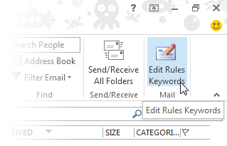

# Outlook Rules Manager

## Overview

Over the last couple of years, the amount of spam I receive through my many self-hosted email accounts has increased massively. As quick as I set up outlook rules to tackle this, the spammers change the keywords, spelling, email addresses, or something else that will sidestep the rules I've carefully set up.

Not only this, but I have a decent amount of folders I want personal or subscription emails routed to, as well as numerous clients whose mail I want to go directly to their project folder.

Unfortunately, clicking through all the steps in Outlook's Rules Wizard is more than a little cumbersome, so I spent a few hours building this Rules Manager in VBA.

The tool now saves me from around 30 - 50 spam emails a day.

## Implementation

The panel is written in VB6, and is a pretty basic form, attached to some simple code to populate it with existing rules, and a panel to edit specific email parameters like "With words in Sender's address" or "With specific words in the message header".

The advantage of using a panel are that it can be quickly spawned to run sets of rules, and it can be quickly edited, plus isn't modal, so you can batch-add sets of email addresses or key words without having to exit.

## User interface

As of October 2013, the UI now looks like this:

The following functionality is new:

- Rules can be quickly selected using the left-hand pane
- Rules can be reordered using the up/down arrows
- The "Stop processing more rules" action can now be toggled
- Changes are automatically saved

Additionally, the Conditions pane accepts dragged items:

- Dragging a message with an "email address" condition enters the correct "from" or "to" email @domain on a new line
- Dragging a message with a "subject" keyword condition enters the subject on a new line
- Otherwise, dragging any text enters it on a new line (email @domains are automatically extracted)

It's really easy to run it from the ribbon too:

## Links

I may make the panel available for public consumption at some point in the future.
