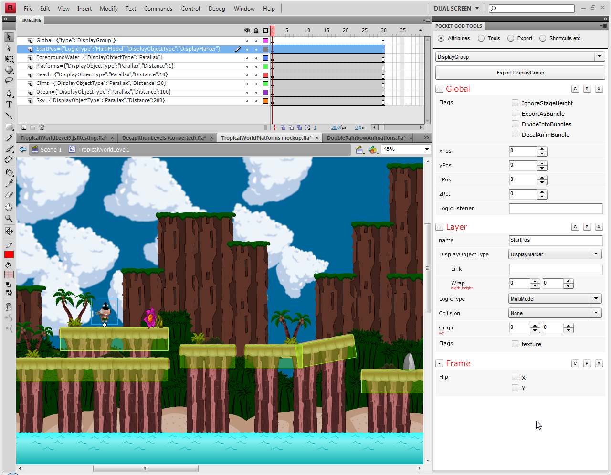
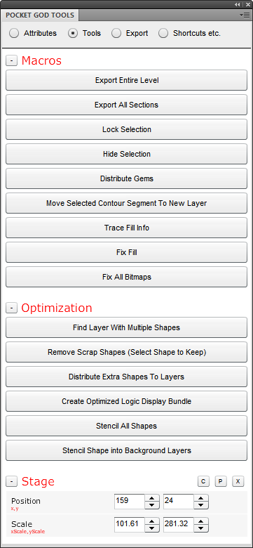
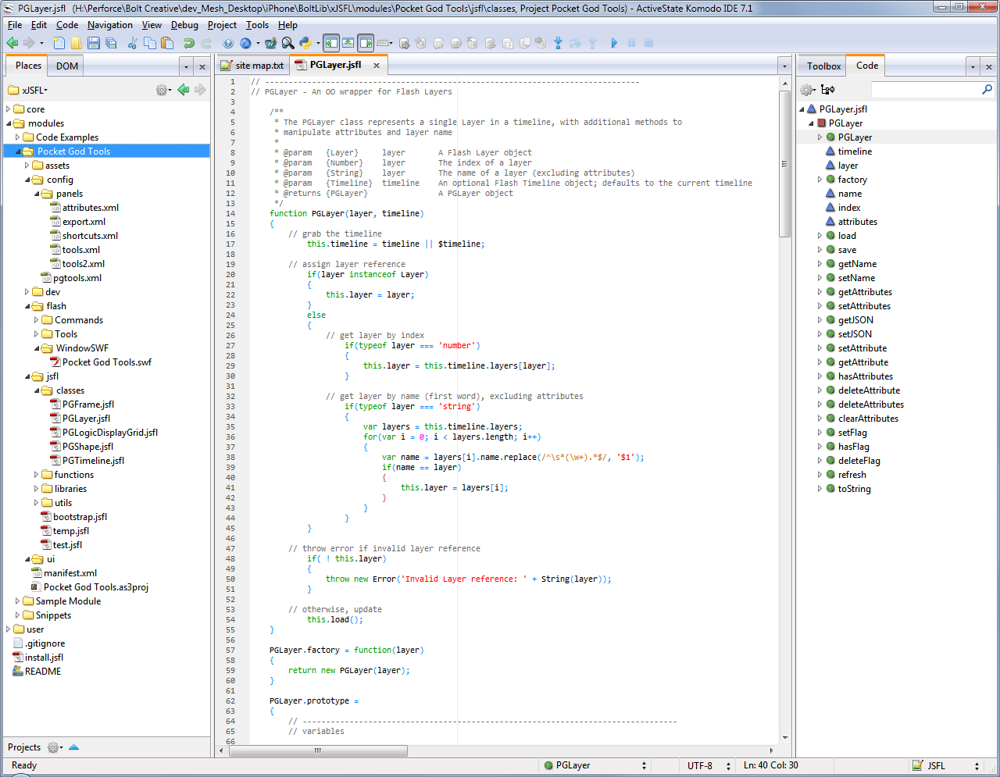

# Pocket God Tools

## Overview

xJSFL was used to pimp the production pipeline of the iOS game Pocket God, by [Bolt Creative](http://www.boltcreative.com/).


Before you get too confused as how Flash is used to build an iPhone game, Bolt actually use Flash extensively in their production pipeline.

The games themselves are all coded on a Mac using X-Code and Objective C, but all the artwork is drawn in Illustrator, exported as bitmaps, then brought into Flash for animating or layout.

## Pipeline

After some pre-processing of the artwork and assets using Python, we import assets into Flash in a specific manner, so that assets are identified in the library by unique paths that map to the original external bitmaps.

Bolt's animator Allan can then set to work animating the characters and other assets that will be used in the final game. Once animated, export routines are run to export all the key frames and movement to custom XML files, which are later compiled to binary for use in iOS.

The levels are also laid out visually in Flash, with game assets as standard Flash library items, as well as a host of tools written and managed using xJSFL.



Again, all this data is managed by the tools written using xJSFL, both in JSFL and AS3.

## Pocket God Tools panel

The bulk of the tool is contained inside the main Pocket God Tools panel, which has further sub panels, all written in AS3.

We developed a robust system of UI controls that are defined using XML, stored in the module's **config/** folder, then loaded into the panel on startup and is used to render control sets relating to the currently open timelines and selected objects:

```xml
<?xml version="1.0" encoding="UTF-8"?>
<xml>
    <panels>
        <!--
            TIMELINE
        -->
        <panel name="Timeline">
            <control type="button" name="Export Timeline" onClick="PGTools.exportCurrent()" />
            <group name="Global">
                <control type="flags" name="Flags">
                    <control type="boolean" name="Loop"/>
                    <control type="boolean" name="RelativeToStage"/>
                </control>
                <control type="number" name="fps"/>
                <control type="number" name="ForceFrameCount"/>
                <control type="string" name="NextAnim"/>
                <control type="string" name="ButtonGroup"/>
            </group>
            <group name="Layer">
                <control type="string" name="name"/>
                <control type="flags" name="Flags">
                    <control type="boolean" name="noTexture"/>
                    <control type="boolean" name="noXPos"/>
                    <control type="boolean" name="noYPos"/>
                    <control type="boolean" name="noRot"/>
                    <control type="boolean" name="noXScale"/>
                    <control type="boolean" name="noYScale"/>
                    <control type="boolean" name="ButtonHitArea"/>
                    <control type="boolean" name="Movement"/>
                </control>
                <control type="string" name="Text"/>
                <control type="option" name="TextAlign">
                    <option name="None" />
                    <option name="Left" />
                    <option name="Center" />
                    <option name="Right" />
                </control>
            </group>
            <group name="Frame">
                <control type="flags" name="Flip">
                    <control type="boolean" name="X" />
                    <control type="boolean" name="Y" />
                </control>
                <control type="string" name="soundId"/>
                <control type="string" name="actionId"/>
            </group>
        </panel>

        ... etc
```

The panel itself is updated automatically as we change timelines or reselect objects, which is managed in turn by xJSFL's [AS3 module framework](https://xjsfl.vercel.app/support/guides/extensibility/as3-module-framework).

With (generally) one item per layer, the parameters defined by the controls are stored directly in layer names in JSON format (this also means we can also quickly read the properties).

At the top of each panel type (we have several, depending on what global timeline type is selected) is a big Export button. This will call one of the PGTools export scripts and will output a custom XML schema of the Timeline's properties, including all element and library item data.

The team will then iterate quite quickly between tweaking the level design in Flash, exporting, then testing the level live in the X-Code development environment.

The remaining panels are also based on the XML-to-controls code written, but mainly hold sets of buttons that link to static libraries to fix any problems or reduce any repetitive tasks the animators or programmers experience:



Finally, we created an interactive panning tool, that pans the current Timeline around with full parallax scrolling on the Timeline clips nested behind. The effect of seeing the dimmed background Timelines scroll behind each other as you drag the tool over the stage really has to be seen to be believed!

## How was xJSFL used specifically?


Pocket God Tools was build as an xJSFL module, meaning that all the code lives in its own folder within a subfolder of the **xJSFL/modules/** directory:



Having everything in a folder outside of the main Flash folder makes it easy to work on sets of files, without Flash's application files getting in the way.

The module system in xJSFL is responsible for:

- Physically structuring assets such as config, code, and assets
- Providing a base Module class which acts as a gateway class to further functionality
- Providing the JSFL and AS3 APIs for AS3 and JSFL to talk to each other
- Automatic instantiation and initialisation by way of a JSFL module bootstrap
- Managing the core assets Flash needs, such as Panels, Commands, Tools, etc

More information can be found in the [Extensibility](https://xjsfl.vercel.app/category/support/guides/extensibility) section [Combining multiple scripts into stand-alone Modules](https://xjsfl.vercel.app/support/guides/extensibility/modules).

On top of the core [Module](https://xjsfl.vercel.app/support/api/framework/module) class, Bolt's tool uses the following xJSFL classes to achieve its aims:

- The [AS3 module framework](https://xjsfl.vercel.app/support/guides/extensibility/as3-module-framework) to create the gateway between the panel and the JSFL environment
- [xjsfl.file.load](https://xjsfl.vercel.app/support/api/core/xjsfl#file-load), [xjsfl.classes.load](https://xjsfl.vercel.app/support/api/core/xjsfl#classes-load), [Folder](https://xjsfl.vercel.app/support/api/file/filesystem#folder) and [File](https://xjsfl.vercel.app/support/api/file/filesystem#file) classes to load content
- [URI](https://xjsfl.vercel.app/support/api/file/uri) class to manipulate URIs
- [Utils](https://xjsfl.vercel.app/support/api/utils/utils) to do general everyday tasks
- [Output](https://xjsfl.vercel.app/support/api/text/output) and [Table](https://xjsfl.vercel.app/support/api/text/table) to print debugging information to the output panel
- [XML](https://xjsfl.vercel.app/support/api/objects/XML) class to interrogate XML properties

In addition to these classes, we also created a whole host of custom wrapper classes for JSFL elements, such as:

- PGTimeline to wrap the main Timeline class and manipulate layers en-mass
- PGLayer to easily set and get JSON parameters on layers
- PGFrame to easily set and get values from native Frame objects
- About 20 additional classes to manage various aspects of element, item and data manipulation

Finally, we have a set of JSFL Commands and native JSFL Tools that are copied to the main Flash folder when Flash starts, along with the main panel instance.

**Note:** if you're interested in the editor above, it's [Komodo IDE](http://www.activestate.com/komodo-ide), the big brother of [Komodo Edit](https://xjsfl.vercel.app/feature/komodo-edit), the free and open-source IDE from ActiveState, both with full JSFL and xJSFL auto-completion, and publishing functionality, via the [xJSFL extension](https://xjsfl.vercel.app/support/setup/komodo/xjsfl-extension).

## Development before and after xJSFL

When Bolt first came to me, their JSFL code was a fragile collection of global functions, string concatenation, overly-large JSFL files, and even JSFL compiled in AS3 strings, executed using MMExecute, all sitting hidden away in Flash's WindowSWF folder.

Now, Pocket God Tools runs as an open, self contained module of libraries and assets within the xJSFL folder structure, adhering to modern OO JavaScript practices, and it is incredibly easy to manage and update with new features as and when we think of them.

The great thing about all of this though, was that [Dave Castelnuovo](http://www.pocketgamer.biz/r/PG.Biz/Pocket+God/feature.asp?c=14726) really had the vision to stretch what the Flash IDE can do, and combined with xJSFL's management capabilities, we've made some pretty stellar tools to make Bolt's lives not only easier, but actually allow the level of complexity they needed for a game layout and management tool.

## Videos

You know what it's like to be a studio under pressure to deliver...

<MediaVideo width="560" height="315" src="https://www.youtube.com/embed/I8jkz0pdHk8" />
