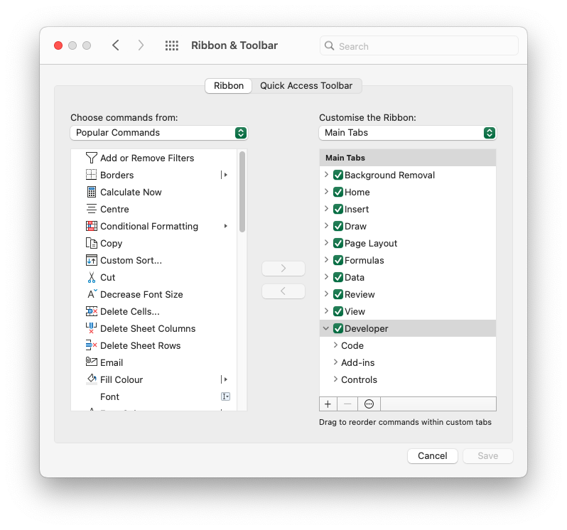

# Excel "copy columns" macro

## Intro

As part of my bookkeeping process I download CSVs and copy selected columns to a more simplified sheet, before moving the individual values into categorised columns to help with budging and accounting requirements:

<MediaGallery media="excel" />

The most time-consuming and error-prone part of this process is selecting and copying the CSV data:

To do this I have to:

- identify source and target columns
- identify previous and current dates
- insert correct number of rows (to target `SUM()`s aren't overwritten)
- select and copy partial source column data, in target column order (possibly via a temporary sheet)
- review / redo if I made any mistakes
- repeat for each account
- repeat for each accounting period

I've been wanting to automate this for _years_, so this weekend I dusted off my ancient VBA skills and finally got to it.

## Usage

Below is the macro in action, on an example expenses sheet:

Running the macro will:

- read header cells from the `target` sheet
- compare the bottom line `Date` in `target` (or start from the selected `source` row)
- grab the corresponding partial `source` columns
- confirm the number of entries and sheets
- copy the values to the `target` sheet

A few nice UX touches; the macro:

- uses `target` sheet headings to determine required data
- inserts full rows before pasting, so any column `SUM`s are shifted down
- pastes values only, so target formatting is respected 
- shows a selection preview during confirmation
- selects the final pasted data

## Installation

The example macro-enabled workbook above can be found here:

- [expenses-example.xlsm](https://1drv.ms/x/s!AgFKfJKDVaVlly9l7JA24feSlsbX)

To download and use locally, choose:

- `File` &gt; `Save As` &gt; `Download a Copy`

To run the macro in the downloaded workbook, choose:

- `Developer` > `Macros` > `Copy_Columns` > `Run`

> Note that there is no undo for Excel macros, so be sure to save the sheet before running.

If you can't see the `Developer` ribbon entry, you may need to enable it in preferences:

To make the macro globally available, you will need to copy it into a module in the global "personal" workbook:

- [Personal Macro Workbook in Excel - make macros available in all workbooks](https://www.ablebits.com/office-addins-blog/excel-personal-macro-workbook/)

The raw VBA code (should you want it) is available here:

- [excel - copy columns.vba](https://gist.github.com/davestewart/8301538c48a09162e868665ec67d6f3a)

The code is very-well commented, so take a look if you want to know what's going on under the hood.

Excel VBA is a little tricky, but I've hopefully iterated on it enough times to identify the footguns, and now there's a certain level of resilience that it should work in most scenarios.

FWIW [I used Chat GPT](https://chat.openai.com/share/8f534429-f345-434e-8262-073f6b83465b) to help me work out a lot of it!

## Summary

The end result should mean when I need to do my accounts, I can just:

- paste in the new CSV rows
- run the macro to copy values
- get on with categorising values

Feel free to leave a comment if you spot any bugs, or need help to understand the code. 

